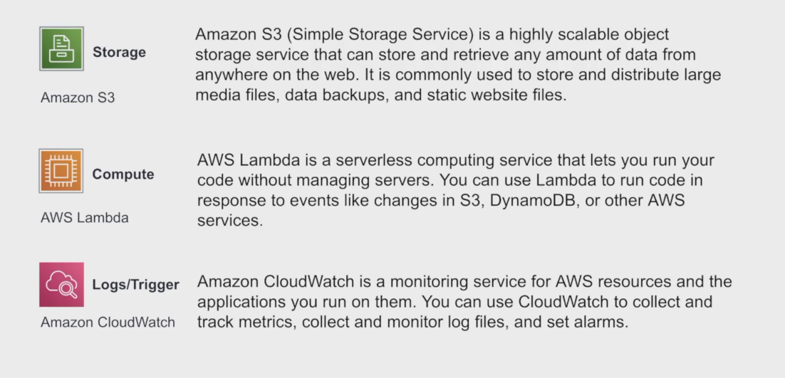
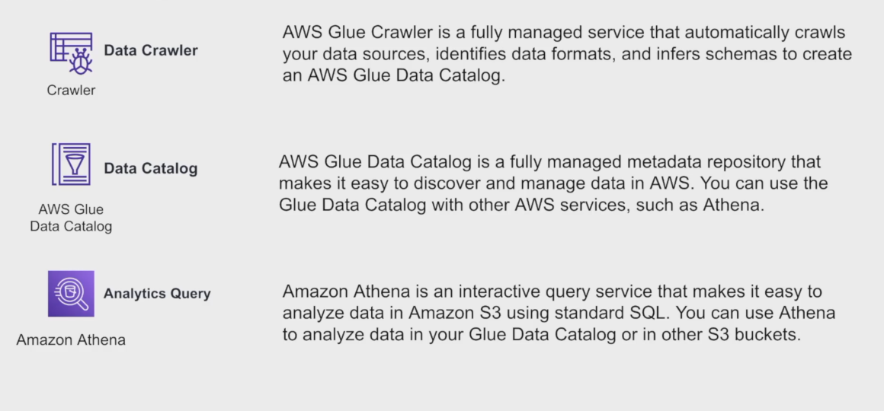

# 🎶 Spotify End-to-End ETL Data Engineering Project on AWS 🚀

This project demonstrates how to build a fully automated, scalable **ETL (Extract, Transform, Load)** data pipeline using **Spotify API** and **AWS services** like Lambda, S3, Glue, and Athena.

The project extracts Spotify's **Top 50** playlist data, processes it through transformations, and stores structured datasets for analytics — all running automatically without manual intervention.

---

## 📌 Project Objective

- Extract Spotify weekly **Top Songs - Global** playlist data.
- Store raw JSON data in Amazon S3.
- Process and transform raw data into structured **Artist**, **Album**, and **Song** tables.
- Store transformed CSV files in S3.
- Catalog the data using AWS Glue.
- Query the data using Amazon Athena.

---

## 🛠️ Solution Architecture




---

## 🎧 Integration with Spotify API

- A developer account is required to access Spotify Web APIs.
- API credentials (Client ID and Secret) are used for secure access.
- Data is pulled from the playlist endpoint using Python's **Spotipy** library.

---

## ☁️ AWS Services Used

| AWS Service | Purpose |
|-------------|---------|
| **AWS Lambda** | Serverless compute for extraction and transformation |
| **Amazon S3** | Storage for raw and transformed data |
| **AWS Glue** | Schema inference and Data Catalog |
| **Amazon Athena** | SQL query engine for S3-based data |
| **Amazon EventBridge** | Trigger Lambda functions on a schedule |

---

## 🛠️ Project Components

| Component | Details |
|-----------|---------|
| **First Lambda Function (Extraction)** | Fetches Spotify playlist JSON and stores it in `raw/to_be_processed/` S3 folder |
| **Second Lambda Function (Transformation)** | Converts raw JSON into structured CSVs (Artist, Album, Song) and stores in `transformed/` |
| **Glue Crawlers** | Auto-detects schema for transformed data and creates Athena query tables |
| **Athena Queries** | Analyze top songs, album counts, and release year trends |

---

## 📂 S3 Bucket Structure
---

## ⚙️ Steps to Reproduce

1. **Spotify Setup**
   - Create a Developer App at [Spotify Developer Dashboard](https://developer.spotify.com/dashboard).
   - Retrieve **Client ID** and **Client Secret**.
   
2. **AWS Setup**
   - Create an S3 bucket (e.g., `spotify-etl-project`).
   - Create two Lambda functions:
     - `spotify_api_data_extract`
     - `spotify_transformation_load_function`
   - Attach required IAM roles to Lambda functions for S3 and CloudWatch access.
   
3. **Lambda Layers**
   - Add required libraries (`spotipy`, `pandas`, `boto3`) to Lambda using layers.

4. **Automation**
   - Use EventBridge to schedule the data extraction Lambda daily.
   - Set up an S3 Event Trigger for the transformation Lambda whenever a new file arrives.

5. **Glue & Athena**
   - Create a Glue Database (`spotify_db`).
   - Create Crawlers for songs, albums, and artists folders.
   - Run queries in Athena after crawler updates.

---
## 📊 Example Athena Queries

```sql
-- Top 10 Popular Songs
SELECT song_name, popularity
FROM songs_data
ORDER BY popularity DESC
LIMIT 10;

-- Count of Albums per Artist
SELECT artist_id, COUNT(DISTINCT album_id) AS album_count
FROM songs_data
GROUP BY artist_id;

-- Albums Released After 2020
SELECT name, release_date
FROM album_data
WHERE release_date > DATE '2020-01-01';

🔥 Technologies Used
Python 3.8+
Spotipy Library
AWS Lambda
Amazon S3
AWS Glue
Amazon Athena
AWS EventBridge
IAM Roles

📷 Snapshots
Spotify API Interaction


🙌 Credits
Spotify Developer Team

AWS Documentation and Services

Project inspired by real-world Data Engineering practices

📚 References
Spotify API Documentation : https://developer.spotify.com/documentation/web-api/
AWS Lambda : https://docs.aws.amazon.com/lambda/
AWS S3 : https://docs.aws.amazon.com/s3/
AWS Glue : https://docs.aws.amazon.com/glue/
Amazon Athena : https://docs.aws.amazon.com/athena/
